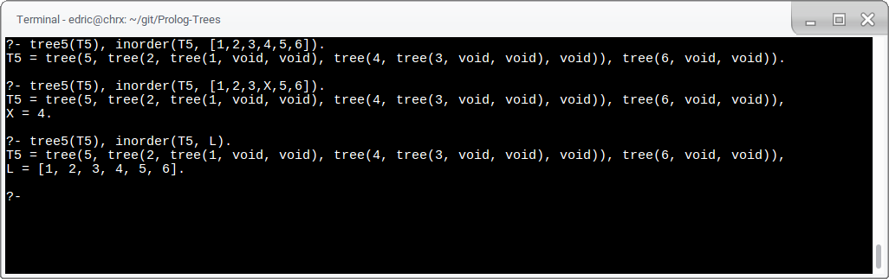
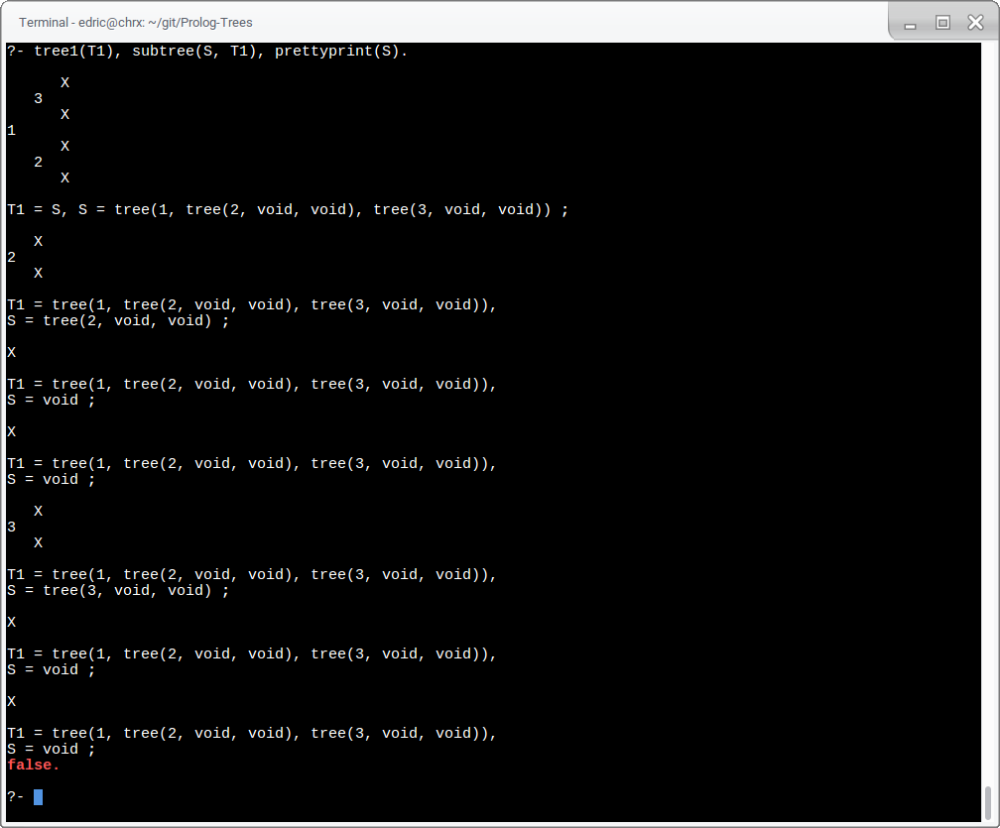
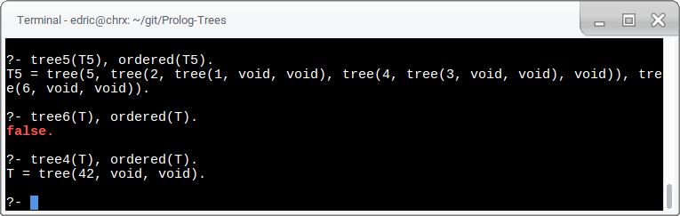
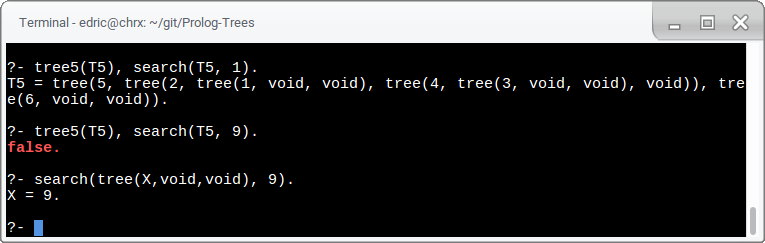
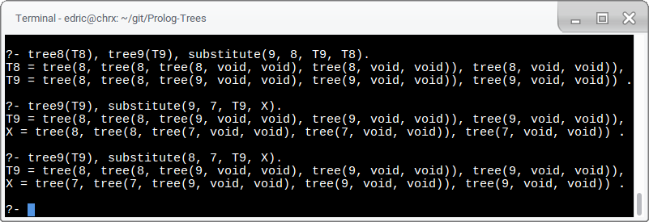
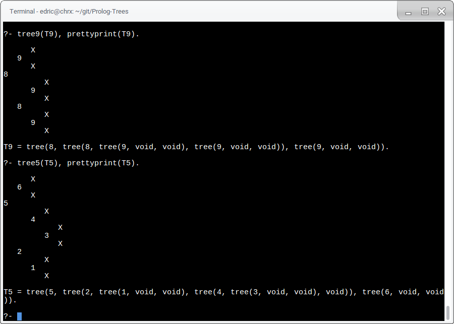
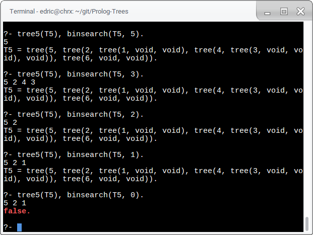

**A04 - Programming Paradigm: Logic**

Student Info
=============

Your name: Edric Yu

Operating system: GalliumOS

Lab computer or your own computer: my own

Did you receive help from your instructor? No

Test Data
==============
~~~
tree1(tree(1,tree(2,void,void),tree(3,void,void))).
tree2(tree(4,tree(5,void,void),tree(6,void,void))).
tree3(
        tree(   1,
                tree(   2,
                        tree(5,void,void),
                        tree(   6,
                                tree(7,void,void),
                                void
                        )
                ),
                tree(3,void,void)
        )
).

tree4(tree(42,void,void)).
tree5(tree(5,tree(2,tree(1,void,void),tree(4,tree(3,void,void),void)),tree(6,void,void))).
tree6(tree(6,tree(2,tree(1,void,void),tree(4,tree(3,void,void),void)),tree(6,void,void))).
tree7(tree(7,tree(2,tree(1,void,void),tree(4,tree(3,void,void),void)),tree(6,void,void))).
tree8(tree(8,tree(8,tree(8,void,void),tree(8,void,void)),tree(8,void,void))).
tree9(tree(8,tree(8,tree(9,void,void),tree(9,void,void)),tree(9,void,void))).

~~~

Rule Implementations
================

`inorder/2`
--------------------------------
`inorder(Tree, List)` is true when `List` is the inorder traversal of `Tree`.

The first line is interesting to read. It's saying that the statement is true when T5
is equal to that tree.
This kind of response happens throughout the rest of the demonstrations.

`subtree/2`
--------------------------------
`inorder(Subtree, Tree)` is true when `Subtree` is a subtree of `Tree`.

This rule can also be used to generate all subtrees of `Tree`.

`sumtree/2`
--------------------------------
`sumtree(Tree, Sum)` is true when the elements of `Tree` sum to `Sum`.
It uses a helper rule `sumlist/2` to compute the sum of the list
generated from `inorder/2`.

`ordered/1`
--------------------------------
`ordered(Tree)` checks if `Tree` is ordered like a binary search tree.

`search/2`
--------------------------------
`search(Tree, Key)` finds if `Key` is in `Tree`.
It actually invokes the provided `tree_member/2`.

`substitute/4`
--------------------------------
The trickiest rule to implement.
`substitute(X, Y, TreeX, TreeY)` checks if
`TreeY` is the result of replacing all occurrences of `X` in `TreeX` with `Y`.

I noticed that I needed a double implication, which doesn't really exist
in prolog except for rule declarations. So I made `substituted/4`.
`substituted(XValue, YValue, X, Y)` makes sure

`XValue = YValue`   

(x)or

`XValue = X and YValue = Y`.

Remember, T8 is a tree of all 8s, and T9 is like T8 but with 9s at each leaf.

`substitute/4` can verify or find trees with substitutions made.

`substitute/4` can also find the trees that would
make the substitute result in the desired tree.

Extra credit
=================

`prettyprint/1`
--------------------------------
It works! It was never explicitly stated that we could use `tab/1`,
so I made my own `tab_over/1`.

`binsearch/2`
--------------------------------
(refer to T5 prettyprint from above)

Assignment Reflection
======================

Hours to complete assignment: ~4

Understanding prolog is pretty cool!
I'm not sure if I was supposed to just use `tree_member` to implement `search`. 
<!-- Markdeep: -->